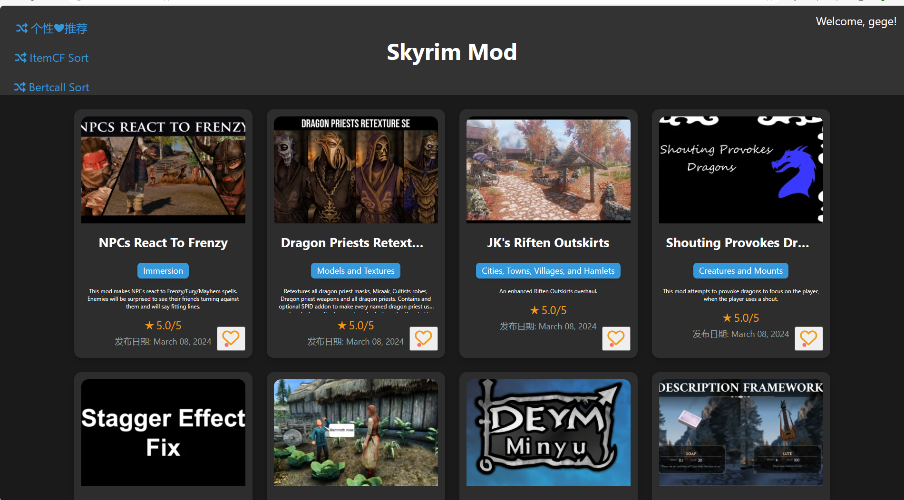
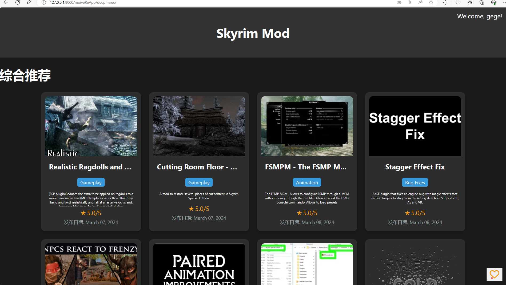
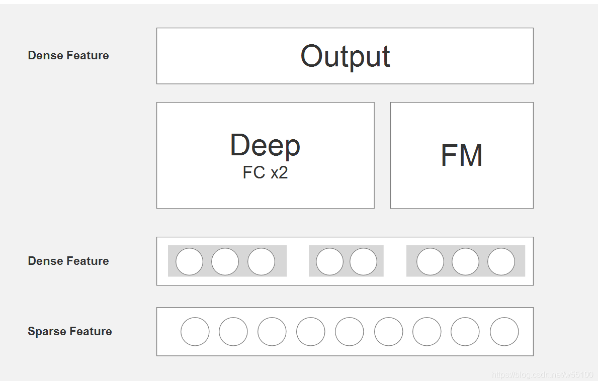

### 整个框架正在进行更新重写

##计划
1.大量增加物品量
2.更新召回路
3.粗排/精排的重写
4.引入重排
5.进行离线测试&小规模AB测试

原本想做电影推荐系统的，但是很多人做过了  （有前端）
这里做一个上古卷轴mod得推荐系统，我看像n网什么的都是热度推荐很少有为用户
进行个性化得推荐。

目前本地网站已经写得差不多了，还特地美化了一下，马上就可以开始爬数据开始
写推荐系统了。

现在的话直接下载到本地cd到moiveRe文件夹然后去终端python manage.py runsever就行了
具体操作代码看django。

# 废话不多说先上效果图

# 使用提示
终端python manage.py runsever即可，进入对应网页

crawler: 数据爬虫，爬取对应网站的物品。

# 大致推荐框架

## 召回部分:
实行多路召回 一共四路:
1.用户兴趣标签
2.协同过滤:因为用户数量少，基于用户的行为使用itemcf对物品相似度的计算会不太准确，所以我们加上客观分析,也就是distll物品的描述：itemcf+distillbert共同计算物品相似度；再算分
3.物品新颖度
4.物品热度/流行度

## 排序部分：

将召回部分得到的总召回，以其对应的4中特征值标准化处理后进入DeepFM中进行CTR预测，根据预测值得到最终排序
再通过用户对推荐内容的反馈对其生成标签产生训练数据从而针对不同用户个性化地训练了DeepFM。
这里分为两部分
1.离线的周期性训练，每隔一段时间根据收集到的"大"量数据针对所有用户训练DeepFM参数
2.在线实时训练，根据用户每几次的click/点赞 行为进行实时标签生成，即刻投入DeepFM实时训练，并且增大学习率，显著地反应用户近期兴趣变化

# 测试效果

因为是本地自己测试，我就爬了N网上200多个物品，然后自己根据推荐结果来挑，意外还不错，我是比较喜欢动画替换之类的，而且是华丽地战斗动画，反复训练几次
后还是每轮都给我推荐到了；线上AB测试等我以后多爬点数据慢慢点吧////// 

数据太少就没做评估了，这个项目主要还是全流程地从前端开始一步一步完成各个框架，最后效果还可以，收获也挺大

一些废话：
设置环境变量，指向你的Django项目的settings模块
os.environ.setdefault('DJANGO_SETTINGS_MODULE', 'moiveRe.settings')
配置Django
django.setup()
这个一直报错找不到moiveRe.settings
原因是一定要把py文件放在moiveRe根目录下面。要不就识别不到。
